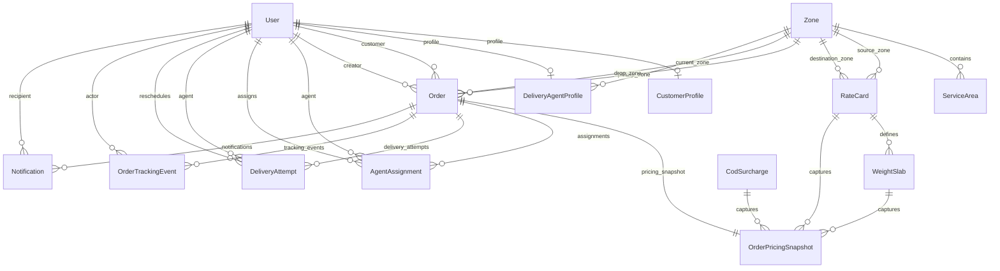

# LastMileX

[](https://nextjs.org/) [](https://supabase.com/) [](https://www.typescriptlang.org/) [](https://vitest.dev/)

LastMileX is a last-mile delivery and dispatch platform for managing orders from quote through delivery. It provides separate workflows for customers, delivery agents, and operations administrators, with server-side authorization and a deterministic pricing and assignment model.

**Contents:** [What it does](#what-it-does) · [Architecture](#architecture) · [Schema visualizer](#supabase-schema-visualizer) · [System design](#system-design) · [Setup](#local-setup) · [Quality checks](#quality-checks) · [Security](#security-guarantees)

## What It Does

- Calculates delivery quotes from pickup and drop PIN codes, package dimensions, weight, order type, route type, and payment type.
- Preserves an immutable pricing snapshot when an order is created.
- Manages zones, service areas, rate cards, weight slabs, and COD surcharges.
- Supports customer order booking, tracking, notifications, and delivery rescheduling.
- Assigns orders manually or through a deterministic agent assignment service.
- Enforces the delivery lifecycle with role-aware state transitions and append-only tracking events.
- Provides operational dashboards for customers, delivery agents, and administrators.
- Records notification history and supports retry handling for failed notifications.

## Roles

| Role | Main capabilities |
| --- | --- |
| Customer | Register, request quotes, create orders, track deliveries, view notifications, and reschedule failed deliveries |
| Delivery agent | View assigned orders, update delivery progress, report failures, and manage availability/location |
| Administrator | Manage zones and pricing, view all orders, manage agents, assign work, retry notifications, and perform audited operational actions |

## Demo Credentials

The seed data includes one account for each application role:

| Role | Email | Local demo password |
| --- | --- | --- |
| Administrator | `admin@lastmilex.com` | Value of `SEED_ADMIN_PASSWORD` |
| Delivery agent | `agent@lastmilex.com` | Value of `SEED_AGENT_PASSWORD` |
| Customer | `customer@example.com` | Value of `SEED_CUSTOMER_PASSWORD` |

Before seeding, set these values in `.env.local`. They are the passwords used by the local demo accounts:

```dotenv
SEED_ADMIN_PASSWORD="LastMileX-Demo-2026!"
SEED_AGENT_PASSWORD="LastMileX-Demo-2026!"
SEED_CUSTOMER_PASSWORD="LastMileX-Demo-2026!"
```

## Architecture

LastMileX is a modular monolith built with Next.js App Router. Route handlers handle HTTP concerns, services contain business rules, repositories contain Prisma access, and Zod schemas validate external input.

```text
Browser
  -> Next.js pages and route handlers
  -> authentication and RBAC
  -> domain services
  -> repositories and Prisma
  -> Supabase PostgreSQL

Supabase Auth provides identity and sessions.
Resend and Twilio are optional notification providers.
```

Key domain services include:

- `rate-engine`: zone resolution, chargeable weight, rate-card lookup, and COD pricing
- `order`: order creation, pricing snapshots, lifecycle transitions, and tracking
- `assignment`: agent filtering, scoring, capacity checks, and reassignment
- `notification`: event notifications, provider integration, idempotency, and retries
- `zone`, `user`, and `delivery-agent`: operational configuration and profile management

See [docs/architecture.md](docs/architecture.md), [docs/api-design.md](docs/api-design.md), and [docs/order-lifecycle.md](docs/order-lifecycle.md) for the detailed design.

## Supabase Schema Visualizer

The application database is hosted in Supabase PostgreSQL and accessed through Prisma. This ER diagram mirrors the production-facing schema: geography drives zone resolution, rate cards drive pricing, and orders retain immutable pricing and tracking history.



### Schema at a glance

| Area | Tables | Responsibility |
| --- | --- | --- |
| Identity | `users`, `customer_profiles`, `delivery_agent_profiles` | Users, roles, agent capacity, and customer defaults |
| Geography | `zones`, `service_areas` | PIN-code to delivery-zone resolution |
| Pricing | `rate_cards`, `weight_slabs`, `cod_surcharges` | Versioned rates and COD rules |
| Orders | `orders`, `order_pricing_snapshots` | Delivery requests and frozen pricing history |
| Execution | `agent_assignments`, `delivery_attempts` | Assignment history and delivery attempts |
| Audit | `order_tracking_events`, `notifications` | Append-only tracking and notification delivery history |

The canonical Prisma definition is in [`prisma/schema.prisma`](prisma/schema.prisma), with the database rationale and indexing strategy in [`docs/database-design.md`](docs/database-design.md).

## System Design

LastMileX is built around four cooperating domain workflows. Each workflow keeps its business rules in a server-side service, reads configuration through repositories, and records important decisions so operations can explain what happened later.

### Rate Calculation Engine

The rate engine is a deterministic service with no UI or HTTP dependencies. It receives pickup and drop addresses, package dimensions, actual weight, customer type, and payment type. It resolves both PIN codes to zones, classifies the route as intra-zone or inter-zone, and calculates volumetric weight using `length x breadth x height / 5000`. Chargeable weight is the greater of actual and volumetric weight, rounded up to the nearest 0.5 kg.

The engine then selects the active rate card for the customer type, route, zone pair, and effective date. The matching weight slab supplies a base price and an incremental per-kilogram rate. COD orders additionally use the active surcharge rule, supporting flat fees or percentages with minimum and maximum caps. The result includes a full pricing breakdown. When an order is confirmed, that breakdown is persisted as an immutable `OrderPricingSnapshot`, so later rate-card changes affect only future orders.

### Zone Detection

The MVP uses a reliable database-driven mapping rather than requiring a geocoding provider. A pickup or drop PIN code is looked up in `service_areas`; each active service area belongs to one active `zone`. The two resolved zones determine the route type used by the pricing engine and assignment workflow.

If either PIN code is not mapped to an active service area, the request fails with an unsupported-area error and order creation is blocked. This makes service coverage explicit and configurable for administrators. A future geocoding integration can extract or validate PIN codes from free-text addresses while preserving the same `ServiceArea -> Zone` model.

### Auto-Assignment Logic

Auto-assignment first filters delivery agents by active status, availability, and capacity. Agents whose current zone matches the pickup zone are preferred; if none are suitable, the search can expand to other available agents. Candidates are ranked with an explainable score based on zone match, inverse workload, proximity from last-known location when available, and activity recency. Deterministic tie-breaking ensures the same inputs produce the same winner.

Assignment is protected against concurrent requests. The service uses an atomic conditional update that reserves capacity only while the agent remains available and below `maxConcurrentOrders`. If another request claims that capacity first, the candidate is skipped and the next-ranked candidate is tried. Successful assignments create assignment and delivery-attempt records, increment workload, update the order state, and emit tracking and notification events.

### Failed Delivery Handling

An agent can mark an order as failed only from the delivery-attempt state and must provide a failure reason. The operation records an immutable tracking event, marks the assignment and attempt as completed or failed, releases the agent's active capacity, and notifies the customer with the available next step.

Customers may reschedule only for a future date and only while the current attempt is below the configured maximum, which defaults to three. Rescheduling increments the attempt number, creates a new `DeliveryAttempt`, updates the scheduled date, and returns the order to the assignment pool. Idempotency checks prevent duplicate reschedule requests, while the complete attempt and tracking history remains available for audit. Once the maximum is reached, the order stays `FAILED` for administrative resolution rather than entering an unbounded retry loop.

See [`docs/system-design-outline.md`](docs/system-design-outline.md) for the expanded design notes and [`docs/order-lifecycle.md`](docs/order-lifecycle.md) for the complete state-transition rules.

## Tech Stack

- Next.js 15 with App Router and React 19
- TypeScript with strict checking
- Tailwind CSS
- Supabase Auth and PostgreSQL
- Prisma ORM
- Zod validation
- Vitest unit and integration tests
- Vercel-compatible deployment model

## Prerequisites

- Node.js 20 or newer
- npm
- A Supabase project with Email/Password authentication enabled
- PostgreSQL connection URLs from Supabase

## Local Setup

Clone the repository and install dependencies:

```bash
git clone https://github.com/sakethksg/LastMileX.git
cd LastMileX
npm install
```

Create a local environment file:

```bash
cp .env.example .env.local
```

Set these required variables in `.env.local`:

| Variable | Purpose |
| --- | --- |
| `NEXT_PUBLIC_SUPABASE_URL` | Supabase project URL |
| `NEXT_PUBLIC_SUPABASE_ANON_KEY` | Browser-safe Supabase key |
| `NEXT_PUBLIC_APP_URL` | Application URL, normally `http://localhost:3000` locally |
| `SUPABASE_SERVICE_ROLE_KEY` | Server-only Supabase administrative key |
| `DATABASE_URL` | Pooled PostgreSQL URL for application runtime |
| `DIRECT_URL` | Direct PostgreSQL URL for Prisma migrations |

Never expose `SUPABASE_SERVICE_ROLE_KEY`, `DATABASE_URL`, or `DIRECT_URL` with a `NEXT_PUBLIC_` prefix or commit real secrets. Optional `RESEND_*` and `TWILIO_*` variables enable external notification providers; without them, the application uses its in-memory notification provider.

Validate the schema, generate Prisma Client, and apply local migrations:

```bash
npx prisma validate
npx prisma generate
npx prisma migrate dev
```

Seed and verify development data:

```bash
npm run db:seed
npm run db:verify-seed
```

The seed is idempotent and creates Auth-linked persona users plus geography, pricing, and lifecycle fixtures. Set the `SEED_*_PASSWORD` variables locally only when new Auth users need to be created. To test password login for seeded personas, run:

```bash
npm run auth:verify
```

## Run The App

```bash
npm run dev
```

Open `http://localhost:3000` in a browser. For a production-like run:

```bash
npm run build
npm run start
```

## Quality Checks

The CI pipeline runs the same core checks:

```bash
npm run typecheck
npm run lint
npm run test
npm run build
```

Prisma checks useful before database changes:

```bash
npx prisma validate
npx prisma migrate status
```

## Order Lifecycle

Orders follow a controlled lifecycle:

```text
CREATED -> CONFIRMED -> ASSIGNED -> PICKED_UP -> IN_TRANSIT
         -> OUT_FOR_DELIVERY -> DELIVERED
                              -> FAILED -> RESCHEDULED
```

Every status change creates an append-only tracking event. Failed deliveries retain their attempt history, and rescheduling is limited by the configured maximum attempt count. Existing orders keep their original pricing even when rate cards change.

## Security Guarantees

- Authentication and authorization are enforced on the server.
- Customers can access only their own orders.
- Delivery agents can act only on orders assigned to them.
- External request payloads are validated with Zod.
- Privileged database credentials stay server-side.
- Invalid lifecycle transitions are rejected.
- Pricing is calculated server-side; client-submitted totals are not trusted.
- Tracking history is append-only.

## Repository Layout

```text
src/
  app/            Pages, layouts, and API route handlers
  components/     Shared UI components
  config/         Environment and application configuration
  context/        Auth and navigation context
  lib/            Prisma, Supabase, API, and domain utilities
  repositories/   Database access through Prisma
  schemas/        Zod request schemas
  services/       Domain business logic
  types/          Shared domain and API types
prisma/           Schema, migrations, seed, and database policies
tests/            Unit and integration tests
docs/             Architecture, API, operations, and design documents
```

## Deployment

The intended deployment model is Next.js on Vercel with Supabase PostgreSQL and Supabase Auth. In production, use the pooled `DATABASE_URL` for runtime queries and `DIRECT_URL` for migrations:

```bash
npx prisma migrate deploy
npm run build
npm run start
```

Read [docs/production-setup.md](docs/production-setup.md) for the production environment, connection pooling, seed, and pre-deployment checklist.

## Current MVP Boundaries

- Tracking uses HTTP state transitions and polling rather than live GPS streaming.
- Agent proximity uses the last reported location; there is no live GPS feed.
- Payment records model `PREPAID` and `COD`; no payment gateway is included.
- Email and SMS integrations are optional; local development defaults to an in-memory provider.
- PIN-code service-area mapping is used instead of geospatial routing.

## License

This project is licensed under the MIT License.
