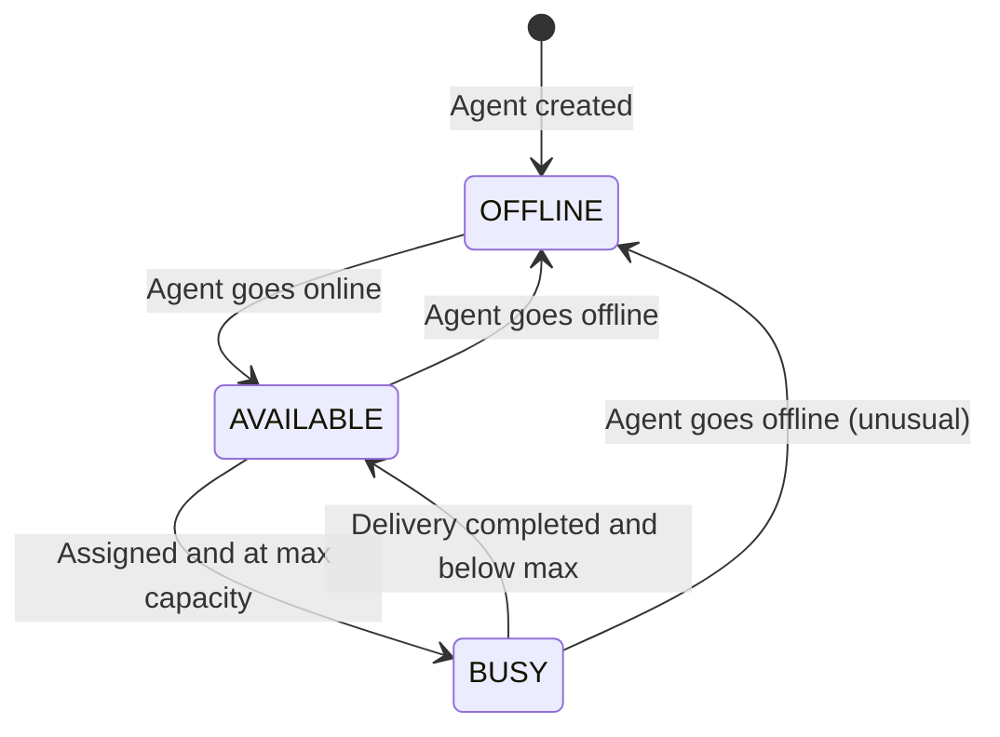

# Agent Assignment - LastMileX

## Overview
The assignment system matches delivery agents to orders using zone-based filtering, availability checks, and workload scoring. It supports both manual (admin-initiated) and automatic assignment.

## Agent Availability Model

### States
| State | Description | When Set |
|---|---|---|
| AVAILABLE | Agent is ready to accept deliveries | Agent logs in, completes delivery (if below max), manual toggle |
| BUSY | Agent is at maximum concurrent delivery capacity | Automatically when activeDeliveryCount >= maxConcurrentOrders |
| OFFLINE | Agent is not working | Agent logs off, end of shift, manual toggle |

### State Transitions


### Automatic Availability Updates
- When assigned: if activeDeliveryCount >= maxConcurrentOrders → BUSY
- When delivery completed/failed: activeDeliveryCount--, if was BUSY and now < max → AVAILABLE
- Agent can manually toggle AVAILABLE ↔ OFFLINE
- BUSY is system-managed only

## Manual Assignment

### Flow
1. Admin selects order (must be CONFIRMED or RESCHEDULED)
2. Admin selects agent from available agents list
3. System validates:
   - Order is in valid status (CONFIRMED or RESCHEDULED)
   - Agent exists and isActive
   - Agent availability is AVAILABLE (not OFFLINE or BUSY)
   - Agent's activeDeliveryCount < maxConcurrentOrders
4. Create AgentAssignment record (type: MANUAL)
5. Create/update DeliveryAttempt
6. Update order status → ASSIGNED
7. Increment agent's activeDeliveryCount
8. Create TrackingEvent
9. Send notification

### Validation Errors
- AGENT_NOT_FOUND: Agent ID doesn't exist
- AGENT_UNAVAILABLE: Agent is OFFLINE
- AGENT_AT_CAPACITY: Agent's activeDeliveryCount >= maxConcurrentOrders
- INVALID_ORDER_STATUS: Order not in CONFIRMED/RESCHEDULED
- AGENT_NOT_ACTIVE: Agent account is deactivated

## Auto-Assignment Algorithm

### Overview
Deterministic, explainable algorithm that selects the best available agent for an order based on configurable scoring criteria.

### Step-by-Step Algorithm

```
autoAssign(orderId):
  1. Load order (validate status is CONFIRMED or RESCHEDULED)
  2. Determine pickup zone from order.pickupZoneId
  
  3. CANDIDATE FILTERING:
     a. Query agents WHERE:
        - isActive = true
        - availability = 'AVAILABLE'
        - activeDeliveryCount < maxConcurrentOrders
     b. Filter by zone match:
        - Primary: agents WHERE currentZoneId = order.pickupZoneId
        - If no primary candidates: expand to adjacent zones or all zones
     c. Result: candidateAgents[]
  
  4. If candidateAgents is empty → return NO_SUITABLE_AGENT error
  
  5. SCORING (for each candidate):
     score = 0
     
     a. Zone Match Score (weight: 40%):
        - Exact zone match (currentZoneId = pickupZoneId): +40 points
        - Different zone: +0 points
     
     b. Workload Score (weight: 30%):
        - workloadRatio = activeDeliveryCount / maxConcurrentOrders
        - score += (1 - workloadRatio) * 30
        - Lower workload = higher score
     
     c. Proximity Score (weight: 20%):
        - If agent has lastKnownLatitude/Longitude AND order has pickup coordinates:
          distance = haversineDistance(agentLocation, pickupLocation)
          if distance <= 5km: +20 points
          elif distance <= 10km: +15 points
          elif distance <= 20km: +10 points
          elif distance <= 50km: +5 points
          else: +0 points
        - If no location data: +10 points (neutral, don't penalize)
     
     d. Recency Score (weight: 10%):
        - If agent's last completed delivery was recent (within 1 hour): +10 points
        - If within 4 hours: +5 points
        - Else: +0 points
        - Rationale: recently active agents are more likely to be responsive
     
     Total max score: 100 points
  
  6. SELECTION:
     - Sort candidates by score DESC
     - If tie: sort by activeDeliveryCount ASC (prefer least loaded)
     - If still tie: sort by agent.createdAt ASC (deterministic, prefer longer-tenured)
     - Select top candidate
  
  7. ASSIGNMENT (with concurrency protection):
     - BEGIN TRANSACTION
     - Atomically update agent capacity using Prisma `updateMany`:
       ```typescript
       const updated = await prisma.deliveryAgentProfile.updateMany({
         where: {
           id: selectedAgent.id,
           availability: 'AVAILABLE',
           activeDeliveryCount: { lt: selectedAgent.maxConcurrentOrders }
         },
         data: {
           activeDeliveryCount: { increment: 1 }
         }
       });
       ```
     - If `updated.count === 0` (capacity filled or agent unavailable concurrently):
       Rollback/retry with next candidate in ranked list (up to 3 retries)
     - Create AgentAssignment (type: AUTO)
     - If new activeDeliveryCount >= maxConcurrentOrders: update availability = 'BUSY'
     - Atomically update order status (`where: { id: orderId, status: { in: ['CONFIRMED', 'RESCHEDULED'] } }`)
     - Create DeliveryAttempt (or update existing for rescheduled)
     - Create TrackingEvent
     - COMMIT
  
  8. Send notification
  9. Return assignment result
```

### Scoring Configuration
Scoring weights should be defined as configuration constants:
```typescript
const ASSIGNMENT_WEIGHTS = {
  ZONE_MATCH: 40,
  WORKLOAD: 30,
  PROXIMITY: 20,
  RECENCY: 10,
} as const;
```
Future: these could become database-configurable.

## Concurrency Handling

### Problem
Multiple admin users or auto-assign requests could try to assign the same agent simultaneously, leading to:
- Agent assigned more orders than `maxConcurrentOrders`
- Multiple agents assigned to the same order

### Primary Solution: Prisma Atomic Conditional Updates
For high maintainability and clean Prisma ORM compatibility, we use atomic conditional updates:
```typescript
// 1. Atomically claim agent capacity slot
const agentClaim = await prisma.deliveryAgentProfile.updateMany({
  where: {
    id: candidateAgentId,
    availability: 'AVAILABLE',
    activeDeliveryCount: { lt: maxConcurrentOrders }
  },
  data: {
    activeDeliveryCount: { increment: 1 }
  }
});

if (agentClaim.count === 0) {
  // Concurrency conflict: agent was claimed concurrently or became unavailable
  // Move to next candidate in ranked list
  return retryWithNextCandidate();
}

// 2. Atomically assign order if still in assignable state
const orderClaim = await prisma.order.updateMany({
  where: {
    id: orderId,
    status: { in: ['CONFIRMED', 'RESCHEDULED'] }
  },
  data: {
    status: 'ASSIGNED'
  }
});

if (orderClaim.count === 0) {
  // Order was modified or assigned concurrently: revert agent slot and fail
  await prisma.deliveryAgentProfile.update({
    where: { id: candidateAgentId },
    data: { activeDeliveryCount: { decrement: 1 } }
  });
  throw new ConflictError('Order is no longer in assignable status');
}
```

### Optional Fallback: Raw SQL SELECT FOR UPDATE
For operations requiring multi-table locking in a single interactive transaction, raw SQL locking via `prisma.$queryRaw` within `prisma.$transaction` can be used:
```sql
SELECT * FROM delivery_agent_profiles
WHERE id = $1
  AND availability = 'AVAILABLE'
  AND active_delivery_count < max_concurrent_orders
FOR UPDATE;
```

### Retry Strategy
- If selected agent becomes unavailable during assignment: immediately attempt assignment on next candidate in scored list.
- Maximum 3 candidate retry attempts before returning `NO_SUITABLE_AGENT`.

## Fallback Behaviour

### No Suitable Agent Found
1. Return explicit error: NO_SUITABLE_AGENT
2. Order remains in CONFIRMED/RESCHEDULED status
3. Admin receives notification (optional, configurable)
4. Admin can manually assign later or retry auto-assignment
5. No automatic retry/queue for MVP

### No Location Data
- If agent has no lastKnownLatitude/Longitude: proximity score = 10 (neutral)
- Algorithm still functions; zone match and workload are primary factors
- System encourages agents to update location but doesn't require it

### Agent Zone Not Matching
- If no agents in the pickup zone:
  1. Expand search to ALL available agents (regardless of zone)
  2. Zone match score = 0 for non-matching agents
  3. Workload and other factors determine selection
  4. If still no candidates: NO_SUITABLE_AGENT

## Reassignment

### After Failed Delivery
1. Current AgentAssignment.status → COMPLETED
2. Agent's activeDeliveryCount decremented
3. Order status → FAILED
4. Customer reschedules → RESCHEDULED
5. Order re-enters assignment pool
6. Auto-assign or manual assign selects new agent
7. Previous agent is NOT excluded (they may be the best candidate)
8. New AgentAssignment created with incremented attemptNumber

### Admin Unassignment
1. Admin can unassign an agent (before PICKED_UP only)
2. Current AgentAssignment.status → CANCELLED
3. Order status → CONFIRMED
4. Agent's activeDeliveryCount decremented
5. New assignment can be made

## Assignment History
All assignments are preserved as AgentAssignment records:
- ACTIVE: currently assigned
- COMPLETED: delivery completed (delivered or failed)
- REASSIGNED: superseded by new assignment
- CANCELLED: admin unassigned

This provides full audit trail of who was assigned to what order and when.

## Testing Strategy
- Unit test scoring algorithm with known inputs
- Unit test zone filtering (matching, non-matching, expansion)
- Unit test workload scoring calculation
- Unit test proximity distance calculation
- Unit test tie-breaking logic
- Integration test concurrent assignment (simulate race condition)
- Integration test assignment → delivery completion → availability update
- Integration test reassignment flow (failed → reschedule → reassign)
- Edge case: all agents busy
- Edge case: only one agent available
- Edge case: agent becomes unavailable during assignment transaction
