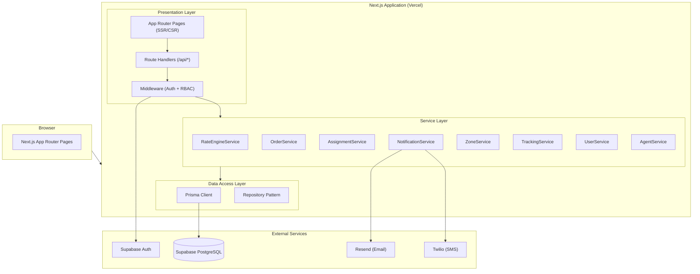
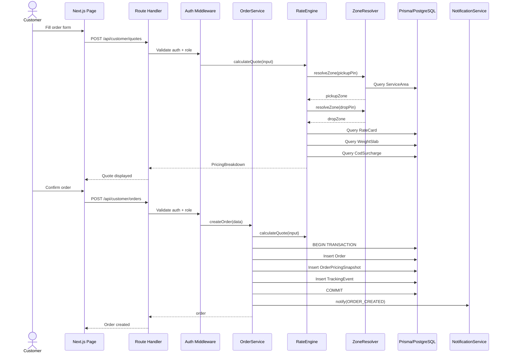
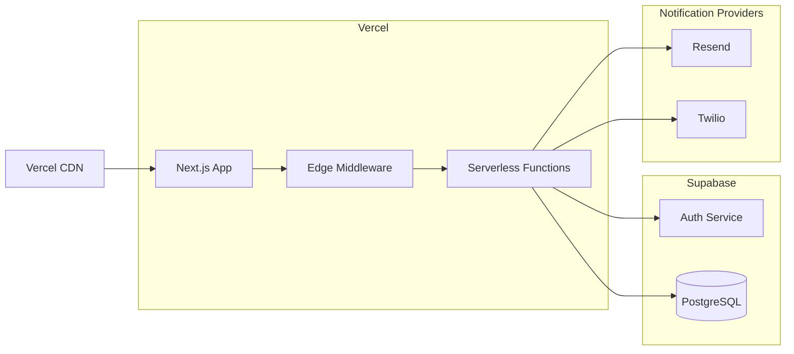

# Architecture - LastMileX

## Overview
LastMileX is a production-quality last-mile delivery management platform built as a modular monolith using Next.js. The architecture emphasizes clean separation of concerns, testability, and independence from infrastructure-specific implementations.

## High-Level Architecture

Create a Mermaid architecture diagram showing:
- Client (Browser) → Next.js App (Vercel)
- Next.js App contains: App Router Pages, Route Handlers (API), Middleware (Auth/RBAC), Service Layer, Data Access Layer (Prisma)
- Service Layer contains: RateEngine, OrderService, AssignmentService, NotificationService, ZoneService, TrackingService
- Data Access Layer → Supabase PostgreSQL
- External: Supabase Auth, Resend (Email), Twilio (SMS)



## Module Boundaries

### Project Structure
```
src/
├── app/                          # Next.js App Router
│   ├── (auth)/                   # Auth pages (login, register)
│   ├── (customer)/               # Customer dashboard pages
│   ├── (admin)/                  # Admin dashboard pages
│   ├── (agent)/                  # Agent dashboard pages
│   ├── api/                      # Route Handlers
│   │   ├── auth/                 # Auth endpoints
│   │   ├── admin/                # Admin endpoints
│   │   ├── customer/             # Customer endpoints
│   │   └── agent/                # Agent endpoints
│   ├── layout.tsx
│   └── page.tsx
├── components/                   # Shared React components
│   ├── ui/                       # shadcn/ui components
│   ├── forms/                    # Form components
│   ├── layout/                   # Layout components
│   └── shared/                   # Shared business components
├── lib/                          # Core library code
│   ├── prisma.ts                 # Prisma client singleton
│   ├── supabase/                 # Supabase client config
│   │   ├── server.ts             # Server-side client
│   │   └── client.ts             # Client-side client (auth only)
│   ├── auth/                     # Auth utilities
│   │   ├── middleware.ts         # Auth middleware
│   │   ├── rbac.ts               # Role-based access control
│   │   └── session.ts            # Session management
│   └── utils/                    # General utilities
├── services/                     # Business logic services
│   ├── rate-engine/              # Rate calculation engine
│   │   ├── rate-engine.service.ts
│   │   ├── zone-resolver.ts
│   │   ├── weight-calculator.ts
│   │   └── types.ts
│   ├── order/                    # Order management
│   │   ├── order.service.ts
│   │   ├── state-machine.ts
│   │   └── types.ts
│   ├── assignment/               # Agent assignment
│   │   ├── assignment.service.ts
│   │   ├── scoring.ts
│   │   └── types.ts
│   ├── tracking/                 # Tracking events
│   │   ├── tracking.service.ts
│   │   └── types.ts
│   ├── notification/             # Notifications
│   │   ├── notification.service.ts
│   │   ├── providers/
│   │   │   ├── email.provider.ts
│   │   │   ├── sms.provider.ts
│   │   │   └── provider.interface.ts
│   │   ├── templates/
│   │   └── types.ts
│   ├── zone/                     # Zone management
│   │   ├── zone.service.ts
│   │   └── types.ts
│   ├── user/                     # User management
│   │   ├── user.service.ts
│   │   └── types.ts
│   └── agent/                    # Agent management
│       ├── agent.service.ts
│       └── types.ts
├── repositories/                 # Data access repositories
│   ├── order.repository.ts
│   ├── zone.repository.ts
│   ├── rate-card.repository.ts
│   ├── agent.repository.ts
│   ├── tracking.repository.ts
│   ├── notification.repository.ts
│   └── user.repository.ts
├── schemas/                      # Zod validation schemas
│   ├── auth.schema.ts
│   ├── order.schema.ts
│   ├── zone.schema.ts
│   ├── rate-card.schema.ts
│   ├── agent.schema.ts
│   └── common.schema.ts
├── types/                        # TypeScript type definitions
│   ├── api.ts                    # API request/response types
│   ├── domain.ts                 # Domain model types
│   └── enums.ts                  # Shared enums
└── config/                       # Configuration
    ├── constants.ts
    └── env.ts                    # Environment variable validation

prisma/
├── schema.prisma
├── migrations/
└── seed.ts

tests/
├── unit/
│   ├── services/
│   │   ├── rate-engine/
│   │   ├── order/
│   │   ├── assignment/
│   │   └── tracking/
│   └── schemas/
├── integration/
│   ├── api/
│   └── services/
└── e2e/
    ├── auth.spec.ts
    ├── order-flow.spec.ts
    └── admin-management.spec.ts
```

## Data Flow

### Order Creation Flow


## Authentication & RBAC Strategy

### Authentication Flow
1. **Registration**: User signs up via Supabase Auth client or admin route → Supabase creates `auth.users` record → application creates corresponding `User` record in `public` schema (`id = auth.users.id`, role, timestamps, metadata) → `CustomerProfile` created. Password credentials reside strictly in `auth.users`.
2. **Login**: Client authenticates via Supabase Auth (`@supabase/ssr` browser client) → Supabase issues JWT session tokens stored in secure, HTTP-only cookies.
3. **Session & Middleware**: Next.js App Router middleware (using `@supabase/ssr` `createServerClient`) refreshes sessions and extracts authenticated user context per request.

### RBAC Implementation
```
Middleware Pipeline:
  1. Extract session from cookies via @supabase/ssr
  2. Validate session with Supabase (supabase.auth.getUser())
  3. Look up User record in application DB via Prisma (includes application role)
  4. Attach verified user context to request headers / server context
  5. Route-level role check:
     - /api/admin/* → requires role = ADMIN
     - /api/customer/* → requires role = CUSTOMER
     - /api/agent/* → requires role = DELIVERY_AGENT
  6. Resource-level ownership check:
     - Customer endpoints: verify order.customerId = currentUser.id
     - Agent endpoints: verify assignment.agentId = currentUser.id
```

### Security Layers
1. **Transport**: HTTPS (Vercel default)
2. **Authentication**: Supabase Auth JWT with `@supabase/ssr` cookie-based verification
3. **Authorization**: Server-side role-based middleware + resource ownership checks
4. **Input Validation**: Zod schemas on every endpoint
5. **Data Access**: Prisma parameterized queries (SQL injection prevention)
6. **Secrets**: Strict environment variable separation (`.env.local`), `SUPABASE_SERVICE_ROLE_KEY` and `DATABASE_URL` never exposed to client
7. **CORS & Headers**: Secure headers and strict origin limits
8. **Rate Limiting**: Per-endpoint protection

### Supabase + Prisma Integration
- **Supabase Auth**: Dedicated exclusively to identity, credential storage, password hashing, and JWT issuance.
- **@supabase/ssr**: Used for isomorphic cookie handling in Next.js Server Components, Server Actions, Route Handlers, and Middleware.
- **Prisma**: Dedicated exclusively to application domain data access, relational integrity, migrations, and business entities.
- **User Sync**: The application `User` entity uses the Supabase `auth.users.id` UUID as PK. No duplicate password storage exists in Prisma.
- **Client Separation**: Browser code uses public anon key only for auth session operations; privileged database access occurs strictly server-side via Prisma.
- **Database URL**: Supabase PostgreSQL connection string with transaction pooling for Prisma.

## Deployment Architecture



### Environment Variables
```
# Supabase
NEXT_PUBLIC_SUPABASE_URL=
NEXT_PUBLIC_SUPABASE_ANON_KEY=
SUPABASE_SERVICE_ROLE_KEY=         # Server-only, never in browser
DATABASE_URL=                       # Prisma connection string
DIRECT_URL=                         # Prisma direct connection (for migrations)

# Auth
NEXTAUTH_SECRET=                    # If using NextAuth adapter
JWT_SECRET=

# Notifications
RESEND_API_KEY=
TWILIO_ACCOUNT_SID=
TWILIO_AUTH_TOKEN=
TWILIO_PHONE_NUMBER=

# App
NEXT_PUBLIC_APP_URL=
NODE_ENV=
```

## Key Architectural Decisions

### 1. Modular Monolith over Microservices
**Decision**: Single Next.js application with clear service boundaries
**Rationale**: Reduces deployment complexity, eliminates inter-service communication overhead, appropriate for project scope. Service modules are structured so they COULD be extracted later.

### 2. Service Layer Pattern
**Decision**: All business logic in `/services/`, route handlers are thin orchestrators
**Rationale**: Enables unit testing without HTTP framework, keeps business rules centralized, prevents logic drift into UI components.

### 3. Repository Pattern for Data Access
**Decision**: Thin repository layer between services and Prisma
**Rationale**: Abstracts Prisma-specific queries, enables mocking in unit tests, provides consistent data access patterns.

### 4. Supabase Auth + Prisma Data Access
**Decision**: Use Supabase for auth only, Prisma for all data access
**Rationale**: Supabase Auth provides robust auth without custom implementation. Prisma provides type-safe, migration-friendly data access. Keeping data access through Prisma ensures framework independence.

### 5. PIN Code Based Zone Detection
**Decision**: PIN code → ServiceArea → Zone mapping for MVP
**Rationale**: Simple, reliable, no external API dependency. Suitable for Indian logistics where PIN codes are well-defined. Future: geocoding can supplement.

### 6. Atomic Conditional Updates + Optimistic Concurrency
**Decision**: Combine optimistic status checks for order lifecycle transitions with Prisma atomic conditional updates (`updateMany` checking `activeDeliveryCount < maxConcurrentOrders`) for agent assignment.
**Rationale**: Eliminates race conditions in agent capacity allocation natively through Prisma without mandatory raw SQL locks, falling back to interactive transactions when multi-table coordination is required.

### 7. shadcn/ui + Tailwind CSS
**Decision**: Component library for consistent UI
**Rationale**: Accessible, customizable, excellent TypeScript support, no external CSS-in-JS runtime. Professional dashboard appearance.

### 8. Immutable Event Sourcing (Partial)
**Decision**: Tracking events are append-only; order table stores current state
**Rationale**: Full event sourcing is overengineering. Hybrid approach gives immutable audit trail plus efficient queries on current state.

### 9. Rate Card Versioning via effectiveFrom
**Decision**: Never mutate rate cards; create new versions with effectiveFrom date
**Rationale**: Preserves historical pricing integrity. Pricing snapshots on orders reference specific rate card versions.

### 10. Notification Outbox Pattern (Simplified)
**Decision**: Store notification records, process inline with retry on failure
**Rationale**: Full outbox pattern with background workers is overengineering for MVP. Inline send with status tracking and retry logic provides adequate reliability.
