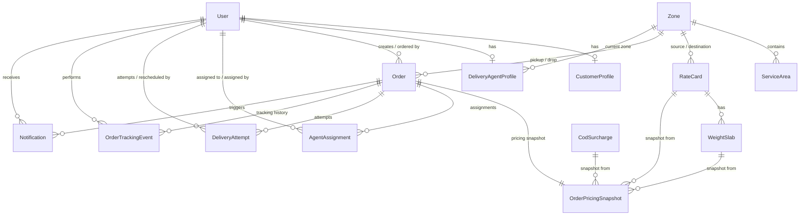

# Database Design - LastMileX

## Overview
PostgreSQL via Supabase, accessed through Prisma ORM. The schema supports a last-mile delivery platform with dynamic pricing, zone management, agent assignment, and immutable tracking.

## Entity Descriptions

### 1. User
- **Purpose**: Primary application user entity and identity reference. Supabase Auth is the sole authority for credentials, password hashing, and token issuance.
- **Key Fields**: id (UUID, PK matching Supabase `auth.users.id`), email (unique), role (enum: CUSTOMER, DELIVERY_AGENT, ADMIN), name, phone, emailVerified, isActive, createdAt, updatedAt. (Note: No `passwordHash` is stored in the application database).
- **Relationships**: Synced with Supabase Auth (`id` = Supabase `auth.users.id`). One-to-one with CustomerProfile, DeliveryAgentProfile. One-to-many with Orders, AgentAssignments, DeliveryAttempts, OrderTrackingEvents, and Notifications.
- **Mutability**: Mutable (profile updates). Soft-delete via isActive flag.
- **Important Indexes**: email (unique), role.
- **Unique Constraints**: email.
- **FK Behavior**: Cascades or restricts depending on child entities (e.g., restricted if active orders exist).

### 2. CustomerProfile
- **Purpose**: Extended customer info.
- **Key Fields**: id (UUID, PK = User.id), userId (FK → User, unique), defaultPickupAddress, defaultPickupPinCode, companyName (for B2B), customerType (B2B/B2C), createdAt, updatedAt.
- **Relationships**: One-to-one with User.
- **Mutability**: Mutable.
- **Important Indexes**: userId.
- **Unique Constraints**: userId.
- **FK Behavior**: Cascades on User delete.

### 3. DeliveryAgentProfile
- **Purpose**: Extended agent info.
- **Key Fields**: id (UUID, PK), userId (FK → User, unique), availability (enum: AVAILABLE, BUSY, OFFLINE), currentZoneId (FK → Zone, nullable), maxConcurrentOrders (default 5), vehicleType, vehicleNumber, lastKnownLatitude, lastKnownLongitude, lastLocationUpdateAt, activeDeliveryCount, createdAt, updatedAt.
- **Relationships**: One-to-one with User. Many-to-one with Zone (current zone).
- **Mutability**: Mutable.
- **Important Indexes**: availability, currentZoneId, (availability + currentZoneId) composite.
- **Unique Constraints**: userId.
- **FK Behavior**: Cascades on User delete; Set null on Zone delete.

### 4. Zone
- **Purpose**: Geographic delivery zones.
- **Key Fields**: id (UUID, PK), name (unique), code (unique, e.g. 'ZONE-NORTH'), description, isActive, createdAt, updatedAt.
- **Relationships**: Has many ServiceAreas. One-to-many with Orders (pickup/drop), RateCards (source/destination), DeliveryAgentProfiles.
- **Mutability**: Soft-delete (isActive).
- **Important Indexes**: code (unique), isActive.
- **Unique Constraints**: name, code.
- **FK Behavior**: Restricts deletion if active associations exist.

### 5. ServiceArea
- **Purpose**: Areas/localities within zones, identified by PIN codes.
- **Key Fields**: id (UUID, PK), name, pinCode (string), locality, city, state, zoneId (FK → Zone), isActive, createdAt, updatedAt.
- **Relationships**: Many-to-one with Zone.
- **Mutability**: Soft-delete (isActive).
- **Important Indexes**: pinCode, zoneId, (pinCode + isActive) composite.
- **Unique Constraints**: (pinCode) — one PIN maps to one zone.
- **FK Behavior**: Cascades or restricts on Zone delete.

### 6. RateCard
- **Purpose**: Pricing configuration for zone-pair + customer-type combinations.
- **Key Fields**: id (UUID, PK), name, customerType (enum: B2B, B2C), routeType (enum: INTRA_ZONE, INTER_ZONE), sourceZoneId (FK → Zone, nullable for INTRA), destinationZoneId (FK → Zone, nullable for INTRA), effectiveFrom (DateTime), effectiveTo (DateTime, nullable), isActive, createdAt, updatedAt.
- **Relationships**: Has many WeightSlabs. One-to-many with OrderPricingSnapshot.
- **Mutability**: Soft-delete; new versions created with new effectiveFrom rather than editing.
- **Important Indexes**: (customerType + routeType + isActive + effectiveFrom), sourceZoneId, destinationZoneId.
- **Unique Constraints**: (customerType + routeType + sourceZoneId + destinationZoneId + effectiveFrom).
- **FK Behavior**: Restricts on Zone delete.

### 7. WeightSlab
- **Purpose**: Weight-based pricing tiers within a rate card.
- **Key Fields**: id (UUID, PK), rateCardId (FK → RateCard), minWeight (Decimal), maxWeight (Decimal), basePrice (Decimal), perKgRate (Decimal), createdAt.
- **Semantics & Formula**: Slabs define $(minWeight, maxWeight]$ brackets. For a given chargeable weight $w$:
  - If $w \le minWeight$, baseCharge = `basePrice`.
  - If $w > minWeight$, baseCharge = `basePrice + (w - minWeight) * perKgRate`.
- **Relationships**: Many-to-one with RateCard.
- **Mutability**: Immutable (create new rate card version instead).
- **Important Indexes**: rateCardId, (rateCardId + minWeight).
- **Unique Constraints**: Slabs within a rate card must not overlap (enforced at application layer).
- **FK Behavior**: Cascades on RateCard delete.

### 8. CodSurcharge
- **Purpose**: Cash-on-delivery surcharge rules.
- **Key Fields**: id (UUID, PK), routeType (enum: INTRA_ZONE, INTER_ZONE), surchargeType (enum: FLAT, PERCENTAGE), surchargeValue (Decimal), minSurcharge (Decimal, nullable - floor for percentage), maxSurcharge (Decimal, nullable - cap for percentage), isActive, effectiveFrom, effectiveTo (nullable), createdAt, updatedAt.
- **Relationships**: One-to-many with OrderPricingSnapshot.
- **Mutability**: Soft-delete, versioned by effectiveFrom.
- **Important Indexes**: (routeType + isActive + effectiveFrom).
- **Unique Constraints**: N/A.
- **FK Behavior**: N/A.

### 9. Order
- **Purpose**: Core order entity.
- **Key Fields**: id (UUID, PK), orderNumber (unique, auto-generated like 'LMX-20260822-XXXXX'), customerId (FK → User), customerType (B2B/B2C), status (enum: CREATED, CONFIRMED, ASSIGNED, PICKED_UP, IN_TRANSIT, OUT_FOR_DELIVERY, DELIVERED, FAILED, CANCELLED, RESCHEDULED), pickupAddress, pickupPinCode, pickupZoneId (FK → Zone), dropAddress, dropPinCode, dropZoneId (FK → Zone), routeType (INTRA_ZONE/INTER_ZONE), packageLength (Decimal), packageBreadth (Decimal), packageHeight (Decimal), actualWeight (Decimal), volumetricWeight (Decimal, computed), chargeableWeight (Decimal, computed), paymentType (enum: PREPAID, COD), totalCharge (Decimal), baseCharge (Decimal), codSurcharge (Decimal, default 0), scheduledDeliveryDate (DateTime, nullable), currentAttempt (Int, default 1), maxAttempts (Int, default 3), notes, createdById (FK → User - supports admin creating on behalf), createdAt, updatedAt.
- **Relationships**: Has many: OrderTrackingEvents, DeliveryAttempts, AgentAssignments. Has one: OrderPricingSnapshot. Many-to-one with User (customer), User (createdBy), Zone (pickup), Zone (drop).
- **Mutability**: Mutable (status changes).
- **Important Indexes**: orderNumber (unique), customerId, status, pickupZoneId, dropZoneId, (customerId + status), (status + createdAt), createdAt.
- **Unique Constraints**: orderNumber.
- **FK Behavior**: Restricts deletion of User and Zones.

### 10. OrderPricingSnapshot
- **Purpose**: Frozen pricing data at time of order confirmation.
- **Key Fields**: id (UUID, PK), orderId (FK → Order, unique), rateCardId (FK → RateCard), rateCardName, customerType, routeType, weightSlabId (FK → WeightSlab), minWeight, maxWeight, basePrice, perKgRate, chargeableWeight, baseCharge, codSurchargeRuleId (FK → CodSurcharge, nullable), codSurchargeType, codSurchargeValue, codSurchargeAmount, totalCharge, snapshotData (JSON - full rate card data for audit), createdAt.
- **Relationships**: One-to-one with Order. Many-to-one with RateCard, WeightSlab, CodSurcharge.
- **Mutability**: IMMUTABLE (never updated after creation).
- **Important Indexes**: orderId.
- **Unique Constraints**: orderId.
- **FK Behavior**: Cascades on Order delete.

### 11. AgentAssignment
- **Purpose**: Tracks agent assignments to orders (historical).
- **Key Fields**: id (UUID, PK), orderId (FK → Order), agentId (FK → User), assignedAt, assignedBy (FK → User - admin or system), assignmentType (enum: MANUAL, AUTO), status (enum: ACTIVE, COMPLETED, REASSIGNED, CANCELLED), completedAt (nullable), attemptNumber (Int), notes, createdAt.
- **Relationships**: Many-to-one with Order, many-to-one with User (agent).
- **Mutability**: Mutable (status changes).
- **Important Indexes**: orderId, agentId, (agentId + status), (orderId + status).
- **Unique Constraints**: N/A.
- **FK Behavior**: Cascades on Order delete.

### 12. DeliveryAttempt
- **Purpose**: Records each delivery attempt.
- **Key Fields**: id (UUID, PK), orderId (FK → Order), attemptNumber (Int), agentId (FK → User, nullable), status (enum: PENDING, IN_PROGRESS, DELIVERED, FAILED), scheduledDate (DateTime), failureReason (nullable), failedAt (nullable), completedAt (nullable), rescheduledById (FK → User, nullable), rescheduledAt (nullable), createdAt, updatedAt.
- **Relationships**: Many-to-one with Order, many-to-one with User (agent).
- **Mutability**: Mutable (status changes).
- **Important Indexes**: orderId, (orderId + attemptNumber) unique.
- **Unique Constraints**: (orderId + attemptNumber).
- **FK Behavior**: Cascades on Order delete.

### 13. OrderTrackingEvent
- **Purpose**: Immutable audit trail.
- **Key Fields**: id (UUID, PK), orderId (FK → Order), previousStatus (nullable for first event), newStatus, timestamp (DateTime, default now), actorId (FK → User), actorRole (enum), note (nullable), metadata (JSON, nullable), createdAt.
- **Relationships**: Many-to-one with Order, many-to-one with User (actor).
- **Mutability**: APPEND-ONLY (no UPDATE, no DELETE). DB trigger or RLS to prevent updates/deletes.
- **Important Indexes**: orderId, (orderId + timestamp), actorId.
- **Unique Constraints**: N/A.
- **FK Behavior**: Cascades on Order delete.

### 14. Notification
- **Purpose**: Notification records.
- **Key Fields**: id (UUID, PK), userId (FK → User), orderId (FK → Order, nullable), type (enum: EMAIL, SMS), channel, eventType (enum: ORDER_CONFIRMED, ASSIGNED, PICKED_UP, IN_TRANSIT, OUT_FOR_DELIVERY, DELIVERED, FAILED, RESCHEDULED), subject, body, status (enum: PENDING, SENT, FAILED, RETRYING), providerMessageId (nullable), errorMessage (nullable), retryCount (Int, default 0), maxRetries (Int, default 3), sentAt (nullable), createdAt, updatedAt.
- **Relationships**: Many-to-one with User, many-to-one with Order.
- **Mutability**: Mutable (status updates for retry).
- **Important Indexes**: userId, orderId, status, (status + createdAt).
- **Unique Constraints**: N/A.
- **FK Behavior**: Cascades on User/Order delete.

## Entity-Relationship Diagram

## Indexing Strategy
- **Customer orders listing**: `(customerId + status + createdAt)`
- **Admin order filtering**: `(status + createdAt)`
- **Agent assignment lookup**: `(agentId + status)`
- **Rate card resolution**: `(customerType + routeType + isActive + effectiveFrom)`
- **PIN code lookup**: `(pinCode + isActive)`
- **Tracking timeline**: `(orderId + timestamp)`

## Historical Data Strategy
- **Rate cards**: Versioned with `effectiveFrom`/`effectiveTo`, never mutated.
- **Order pricing**: Snapshot at confirmation, immutable.
- **Tracking events**: Append-only, never modified.
- **Agent assignments**: Historical records preserved, status updated.
- **Delivery attempts**: All attempts preserved.
- **Zones/areas**: Soft-deleted, never hard-deleted.

## Concurrency Considerations
- **Auto-assignment**: Handled via Prisma atomic conditional updates (`updateMany` with `{ activeDeliveryCount: { lt: maxConcurrentOrders }, availability: 'AVAILABLE' }`). If `count === 0`, concurrency conflict is recognized and system retries with the next candidate. Raw SQL row locks (`SELECT FOR UPDATE`) within interactive transactions can be used where complex multi-row coordination is required.
- **Order status**: Optimistic locking via status check in `WHERE` clause (`UPDATE orders SET status = :newStatus WHERE id = :orderId AND status = :expectedCurrentStatus`).
- **Rate card lookups**: Read snapshot, no locking needed.

## Prisma Schema Notes
- Use `@map` and `@@map` for `snake_case` table/column names in PostgreSQL.
- Use `@default(uuid())` for UUIDs.
- Use `@default(now())` for timestamps.
- Enum types for all status/type fields.
- Composite unique constraints documented above (use `@@unique([])`).

