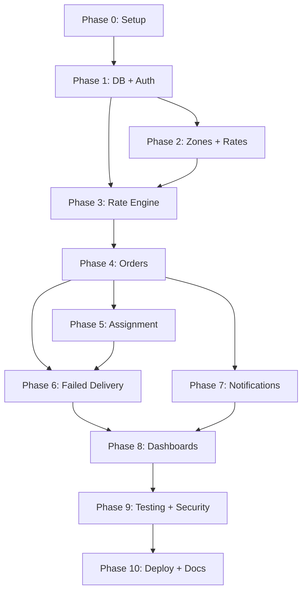

# LastMileX Implementation Plan

> **For agentic workers:** REQUIRED SUB-SKILL: Use superpowers:subagent-driven-development (recommended) or superpowers:executing-plans to implement this plan task-by-task. Steps use checkbox (`- [ ]`) syntax for tracking.

**Goal:** Build LastMileX, a production-quality last-mile delivery management platform with dynamic pricing, zone management, agent assignment, and immutable tracking.

**Architecture:** Next.js modular monolith with App Router, Prisma ORM, Supabase PostgreSQL, service-layer pattern, and repository-based data access.

**Tech Stack:** Next.js 14+, TypeScript (strict), Prisma, Supabase, Zod, shadcn/ui, Tailwind CSS, Vitest, Playwright

**Spec:** [PROJECT_SPEC.md](file:///c:/Notes/LastMileX/PROJECT_SPEC.md)

## Global Constraints
- TypeScript strict mode enabled
- All external input validated with Zod
- All business logic in `/services/`, never in UI components or route handlers
- Consistent API response format: `{ success, data?, error?, meta? }`
- All status transitions create immutable tracking events
- No hardcoded zones, rate cards, COD surcharges
- Prisma for all data access (no direct Supabase data queries)
- Tests required for all business logic

---

## Phase 0: Repository Setup & Engineering Foundations

**Goal:** Initialize Next.js project with all tooling, configuration, and project structure.

**Files:**
- Create: `package.json`, `tsconfig.json`, `next.config.ts`, `.eslintrc.json`, `.prettierrc`, `tailwind.config.ts`, `postcss.config.js`
- Create: `prisma/schema.prisma` (initial empty)
- Create: `vitest.config.ts`, `playwright.config.ts`
- Create: `.env.example`, `.env.local`
- Create: `.gitignore`
- Create: `src/app/layout.tsx`, `src/app/page.tsx`
- Create: `src/lib/prisma.ts` (singleton)
- Create: `src/lib/supabase/server.ts`, `src/lib/supabase/client.ts`
- Create: `src/config/env.ts` (Zod-validated env vars)
- Create: `src/types/api.ts` (standard response types)
- Create: `src/lib/utils/api-response.ts` (response helpers)

**Dependencies:**
- next, react, react-dom
- typescript, @types/react, @types/node
- prisma, @prisma/client
- @supabase/supabase-js, @supabase/ssr
- zod
- tailwindcss, postcss, autoprefixer
- @radix-ui/*, class-variance-authority, clsx, tailwind-merge, lucide-react (shadcn deps)
- vitest, @testing-library/react, @testing-library/jest-dom
- playwright, @playwright/test
- eslint, prettier, eslint-config-next

**Acceptance Criteria:**
- `npm run dev` starts successfully
- `npm run build` passes
- `npm run lint` passes
- `npm run typecheck` passes
- `npm run test` runs (even if no tests yet)
- Prisma client generates successfully
- Environment validation works

---

## Phase 1: Database Schema, Migrations, Authentication & RBAC

**Goal:** Complete Prisma schema, run migrations, set up Supabase Auth integration, implement middleware for role-based access control.

**Files:**
- Modify: `prisma/schema.prisma` (complete schema with all 14 entities)
- Create: `prisma/seed.ts` (seed data for development)
- Create: `src/lib/auth/middleware.ts`
- Create: `src/lib/auth/rbac.ts`
- Create: `src/lib/auth/session.ts`
- Create: `src/middleware.ts` (Next.js middleware)
- Create: `src/app/api/auth/register/route.ts`
- Create: `src/app/api/auth/login/route.ts`
- Create: `src/app/api/auth/me/route.ts`
- Create: `src/schemas/auth.schema.ts`
- Create: `src/services/user/user.service.ts`
- Create: `src/repositories/user.repository.ts`
- Create: `src/types/enums.ts`
- Create: `src/types/domain.ts`
- Create: `tests/unit/schemas/auth.schema.test.ts`
- Create: `tests/unit/services/user.service.test.ts`
- Create: `tests/integration/api/auth.test.ts`

**Acceptance Criteria:**
- Prisma migration runs successfully against Supabase
- All 14 tables created with correct constraints
- User registration creates Supabase auth user + application User record
- Login returns valid JWT
- Middleware correctly validates tokens
- Role-based route protection works (ADMIN, CUSTOMER, DELIVERY_AGENT)
- Unauthorized requests return 401/403
- Seed data populates development database
- All auth tests pass

---

## Phase 2: Zones, Service Areas, Rate Cards & Admin Configuration

**Goal:** Implement zone CRUD, service area CRUD, rate card CRUD with weight slabs, COD surcharge CRUD. Admin-only endpoints.

**Files:**
- Create: `src/services/zone/zone.service.ts`
- Create: `src/repositories/zone.repository.ts`
- Create: `src/schemas/zone.schema.ts`
- Create: `src/app/api/admin/zones/route.ts`
- Create: `src/app/api/admin/zones/[id]/route.ts`
- Create: `src/app/api/admin/service-areas/route.ts`
- Create: `src/app/api/admin/service-areas/[id]/route.ts`
- Create: `src/repositories/rate-card.repository.ts`
- Create: `src/services/rate-card/rate-card.service.ts` (just admin CRUD, not engine)
- Create: `src/schemas/rate-card.schema.ts`
- Create: `src/app/api/admin/rate-cards/route.ts`
- Create: `src/app/api/admin/rate-cards/[id]/route.ts`
- Create: `src/app/api/admin/cod-surcharges/route.ts`
- Create: `src/app/api/admin/cod-surcharges/[id]/route.ts`
- Create: `tests/unit/services/zone.service.test.ts`
- Create: `tests/unit/services/rate-card.service.test.ts`
- Create: `tests/integration/api/admin-zones.test.ts`
- Create: `tests/integration/api/admin-rate-cards.test.ts`

**Acceptance Criteria:**
- Admin can CRUD zones with validation
- Admin can CRUD service areas with zone association
- Admin can CRUD rate cards with weight slabs
- Admin can CRUD COD surcharges
- Rate card versioning works (effectiveFrom/effectiveTo)
- Weight slab overlap validation works
- PIN code uniqueness enforced
- Soft-delete works for zones, areas, rate cards
- Non-admin users get 403
- All tests pass

---

## Phase 3: Rate Calculation Engine & Quote Flow

**Goal:** Implement the core rate engine as an independent service module. Implement customer quote endpoint.

**Files:**
- Create: `src/services/rate-engine/rate-engine.service.ts`
- Create: `src/services/rate-engine/zone-resolver.ts`
- Create: `src/services/rate-engine/weight-calculator.ts`
- Create: `src/services/rate-engine/types.ts`
- Create: `src/schemas/quote.schema.ts`
- Create: `src/app/api/customer/quotes/route.ts`
- Create: `tests/unit/services/rate-engine/rate-engine.service.test.ts`
- Create: `tests/unit/services/rate-engine/zone-resolver.test.ts`
- Create: `tests/unit/services/rate-engine/weight-calculator.test.ts`
- Create: `tests/integration/api/customer-quotes.test.ts`

**Acceptance Criteria:**
- Volumetric weight calculated correctly
- Chargeable weight rounded to nearest 0.5 kg
- Zone resolution from PIN code works
- Intra-zone vs inter-zone detection works
- Rate card lookup selects correct card (specificity > recency)
- Weight slab selection handles boundaries correctly
- Base charge calculation correct
- COD surcharge applied correctly (flat and percentage with min/max)
- Complete pricing breakdown returned
- Quote endpoint returns full breakdown to customer
- All edge cases tested (unsupported area, no rate card, weight out of range)
- Rate engine is independently testable without HTTP

---

## Phase 4: Order Creation & Management

**Goal:** Implement order creation, confirmation, cancellation, customer order listing, and order details.

**Files:**
- Create: `src/services/order/order.service.ts`
- Create: `src/services/order/state-machine.ts`
- Create: `src/services/order/types.ts`
- Create: `src/services/tracking/tracking.service.ts`
- Create: `src/repositories/order.repository.ts`
- Create: `src/repositories/tracking.repository.ts`
- Create: `src/schemas/order.schema.ts`
- Create: `src/app/api/customer/orders/route.ts`
- Create: `src/app/api/customer/orders/[id]/route.ts`
- Create: `src/app/api/customer/orders/[id]/confirm/route.ts`
- Create: `src/app/api/customer/orders/[id]/cancel/route.ts`
- Create: `src/app/api/customer/orders/[id]/tracking/route.ts`
- Create: `src/app/api/admin/orders/route.ts`
- Create: `src/app/api/admin/orders/[id]/route.ts`
- Create: `src/app/api/admin/orders/[id]/status/route.ts`
- Create: `src/app/api/admin/orders/route.ts` (admin create on behalf)
- Create: `tests/unit/services/order/order.service.test.ts`
- Create: `tests/unit/services/order/state-machine.test.ts`
- Create: `tests/unit/services/tracking/tracking.service.test.ts`
- Create: `tests/integration/api/customer-orders.test.ts`
- Create: `tests/integration/api/admin-orders.test.ts`

**Acceptance Criteria:**
- Customer can create order (status = CREATED)
- Order creation calculates pricing and stores snapshot
- Customer can confirm order (CREATED → CONFIRMED)
- Customer can cancel order (CREATED/CONFIRMED → CANCELLED)
- Customer sees only their own orders
- Admin sees all orders with filters
- Admin can create order on behalf of customer
- Admin can override order status
- Every status change creates tracking event
- Tracking events are append-only
- State machine validates transitions
- Invalid transitions return 409
- Optimistic locking prevents race conditions
- Order number auto-generated (LMX-YYYYMMDD-XXXXX)
- All tests pass

---

## Phase 5: Agent Profiles, Availability, Manual & Auto Assignment

**Goal:** Implement agent management, availability model, manual assignment, and auto-assignment algorithm.

**Files:**
- Create: `src/services/agent/agent.service.ts`
- Create: `src/services/assignment/assignment.service.ts`
- Create: `src/services/assignment/scoring.ts`
- Create: `src/services/assignment/types.ts`
- Create: `src/repositories/agent.repository.ts`
- Create: `src/repositories/assignment.repository.ts`
- Create: `src/schemas/agent.schema.ts`
- Create: `src/app/api/admin/agents/route.ts`
- Create: `src/app/api/admin/agents/[id]/route.ts`
- Create: `src/app/api/admin/orders/[id]/assign/route.ts`
- Create: `src/app/api/admin/orders/[id]/auto-assign/route.ts`
- Create: `src/app/api/agent/orders/route.ts`
- Create: `src/app/api/agent/orders/[id]/route.ts`
- Create: `src/app/api/agent/orders/[id]/status/route.ts`
- Create: `src/app/api/agent/availability/route.ts`
- Create: `src/app/api/agent/location/route.ts`
- Create: `tests/unit/services/agent/agent.service.test.ts`
- Create: `tests/unit/services/assignment/assignment.service.test.ts`
- Create: `tests/unit/services/assignment/scoring.test.ts`
- Create: `tests/integration/api/agent-orders.test.ts`
- Create: `tests/integration/api/admin-assignment.test.ts`

**Acceptance Criteria:**
- Admin can create agent accounts (User + DeliveryAgentProfile)
- Agent can toggle availability (AVAILABLE/OFFLINE)
- BUSY managed automatically by system
- Agent can update location
- Agent sees only assigned orders
- Agent can update order status (allowed transitions only)
- Manual assignment works with validation
- Auto-assignment selects correct agent based on scoring
- Zone match prioritized, then workload, proximity, recency
- Concurrent assignment prevented (SELECT FOR UPDATE)
- Agent capacity limits enforced
- No suitable agent returns clear error
- Assignment records created with type (MANUAL/AUTO)
- All tests pass (including concurrency tests)

---

## Phase 6: Failed Delivery, Rescheduling & Reassignment

**Goal:** Implement failed delivery flow, customer rescheduling, delivery attempt tracking, and agent reassignment.

**Files:**
- Modify: `src/services/order/order.service.ts` (add reschedule methods)
- Create: `src/repositories/delivery-attempt.repository.ts`
- Create: `src/schemas/reschedule.schema.ts`
- Create: `src/app/api/customer/orders/[id]/reschedule/route.ts`
- Create: `tests/unit/services/order/reschedule.test.ts`
- Create: `tests/integration/api/customer-reschedule.test.ts`

**Acceptance Criteria:**
- Agent can mark order as FAILED with reason
- Failure creates tracking event with reason
- Customer can reschedule FAILED order
- New delivery attempt record created
- Attempt count incremented, validated against max
- Order status → RESCHEDULED
- Rescheduled order re-enters assignment pool
- Agent reassignment works
- Max attempts enforced (3 default)
- Idempotent reschedule (no duplicate attempts)
- Previous attempt history preserved
- All tests pass

---

## Phase 7: Notifications

**Goal:** Implement notification service with email/SMS providers, triggered by order lifecycle events.

**Files:**
- Create: `src/services/notification/notification.service.ts`
- Create: `src/services/notification/providers/provider.interface.ts`
- Create: `src/services/notification/providers/email.provider.ts` (Resend)
- Create: `src/services/notification/providers/sms.provider.ts` (Twilio)
- Create: `src/services/notification/providers/console.provider.ts` (dev/test)
- Create: `src/services/notification/templates/` (email templates)
- Create: `src/services/notification/types.ts`
- Create: `src/repositories/notification.repository.ts`
- Create: `tests/unit/services/notification/notification.service.test.ts`

**Acceptance Criteria:**
- NotificationService abstraction works
- Email provider sends via Resend API
- SMS provider sends via Twilio API
- Console provider for development/testing
- Notifications triggered for all lifecycle events
- Notification failure does NOT rollback order state
- Notification records stored for audit
- Retry logic for failed sends
- Templates for each event type
- All tests pass (using mock providers)

---

## Phase 8: Customer, Admin & Agent Dashboards

**Goal:** Build the UI for all three user roles.

**Files:**
- Create: `src/app/(auth)/login/page.tsx`
- Create: `src/app/(auth)/register/page.tsx`
- Create: `src/app/(customer)/dashboard/page.tsx`
- Create: `src/app/(customer)/orders/page.tsx`
- Create: `src/app/(customer)/orders/new/page.tsx`
- Create: `src/app/(customer)/orders/[id]/page.tsx`
- Create: `src/app/(customer)/orders/[id]/tracking/page.tsx`
- Create: `src/app/(admin)/dashboard/page.tsx`
- Create: `src/app/(admin)/zones/page.tsx`
- Create: `src/app/(admin)/rate-cards/page.tsx`
- Create: `src/app/(admin)/orders/page.tsx`
- Create: `src/app/(admin)/orders/[id]/page.tsx`
- Create: `src/app/(admin)/agents/page.tsx`
- Create: `src/app/(agent)/dashboard/page.tsx`
- Create: `src/app/(agent)/orders/page.tsx`
- Create: `src/app/(agent)/orders/[id]/page.tsx`
- Create: `src/components/` (shared components)
- Create: E2E tests for critical flows

**Acceptance Criteria:**
- Customer can register, login, create orders, view orders, track deliveries, reschedule
- Admin can manage zones, areas, rate cards, agents, orders, assignments
- Agent can view assigned orders, update statuses, manage availability
- Responsive design
- Loading states and error handling
- Form validation with Zod
- Role-based navigation
- E2E tests pass for critical flows

---

## Phase 9: Testing, Security Review & Cleanup

**Goal:** Comprehensive testing, security hardening, performance review, code cleanup.

**Tasks:**
- Run full test suite, fix failures
- Security audit: check all endpoints for auth/ownership
- Input validation audit: ensure Zod on all endpoints
- Remove dead code
- Add missing error handling
- Performance review: check N+1 queries, add missing indexes
- Lint and typecheck clean
- Production build passes

**Acceptance Criteria:**
- All unit tests pass
- All integration tests pass
- E2E tests pass
- No TypeScript errors
- No ESLint errors
- Production build succeeds
- No exposed secrets
- All endpoints have auth checks

---

## Phase 10: Deployment, Documentation & Final Deliverables

**Goal:** Deploy to Vercel + Supabase, create all documentation.

**Files:**
- Create/Update: `README.md` (professional)
- Create: `.env.example`
- Create: `docs/setup-guide.md`
- Create: `docs/api-documentation.md` (final)
- Update: `docs/system-design-outline.md` (finalize)
- Create: `vercel.json` (if needed)

**Acceptance Criteria:**
- Application deployed and accessible
- README is professional with features, setup, usage
- .env.example has all required variables
- Setup guide is complete
- API documentation is accurate
- System design write-up is ≤800 words
- Database schema documentation is current

---

## Phase Dependencies

