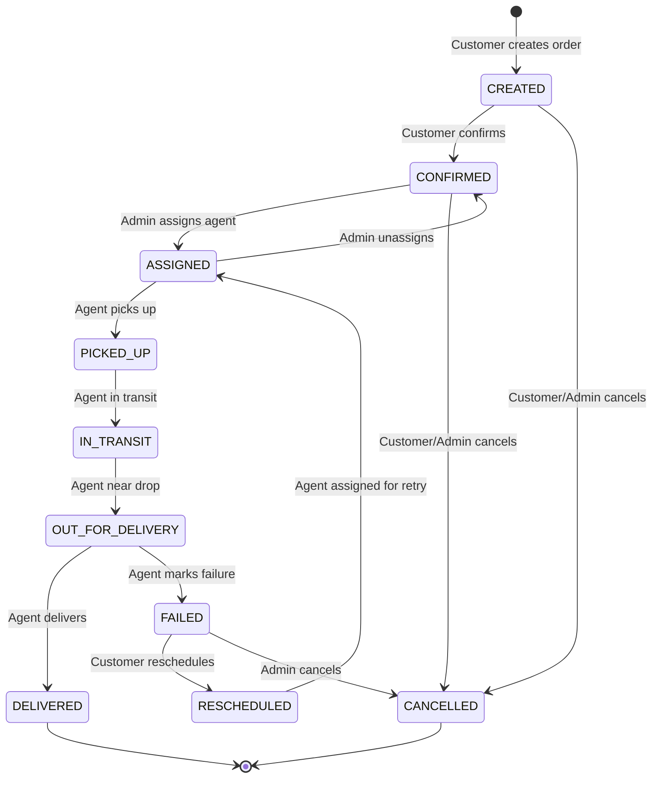
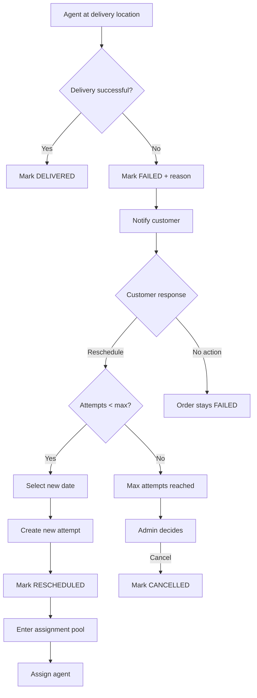

# Order Lifecycle - LastMileX

## Overview
Orders follow a strict state machine. Status transitions are validated server-side. Every transition creates an immutable tracking event.

## Order States

| Status | Description | Entry Condition |
|---|---|---|
| CREATED | Order created, awaiting customer confirmation | Customer submits order form |
| CONFIRMED | Customer confirmed, pricing locked, awaiting assignment | Customer confirms quote |
| ASSIGNED | Agent assigned to order | Manual or auto-assignment |
| PICKED_UP | Agent has collected package from pickup location | Agent updates status |
| IN_TRANSIT | Package is being transported to drop location | Agent updates status |
| OUT_FOR_DELIVERY | Agent is at or near drop location, attempting delivery | Agent updates status |
| DELIVERED | Package successfully delivered to recipient | Agent confirms delivery |
| FAILED | Delivery attempt failed | Agent marks failure with reason |
| CANCELLED | Order cancelled before pickup | Customer or admin cancels |
| RESCHEDULED | Failed order rescheduled for re-delivery | Customer requests reschedule |

### State Justification
- **RESCHEDULED**: Needed to differentiate from CONFIRMED. A rescheduled order has history, a new delivery date, and needs fresh assignment. Without it, re-entering CONFIRMED would lose the semantic distinction.
- **CANCELLED**: Essential for orders that never complete. Prevents confusion with FAILED (which implies an attempted delivery).

## State Machine Diagram

Create a comprehensive Mermaid state diagram showing ALL valid transitions with labels indicating who performs them.



## Transition Rules

For EACH transition, document:

### CREATED → CONFIRMED
- **Who**: CUSTOMER (order owner), ADMIN
- **Preconditions**: Order exists in CREATED status, pricing valid
- **Side Effects**: 
  - OrderPricingSnapshot created (immutable)
  - TrackingEvent created
  - Notification sent: ORDER_CONFIRMED
- **Error Cases**: Order not in CREATED status, rate card expired

### CREATED → CANCELLED
- **Who**: CUSTOMER (order owner), ADMIN
- **Preconditions**: Order in CREATED status
- **Side Effects**:
  - TrackingEvent created with cancellation reason
  - No notification (order was never confirmed)

### CONFIRMED → ASSIGNED
- **Who**: ADMIN (manual), SYSTEM (auto-assign)
- **Preconditions**: Order in CONFIRMED or RESCHEDULED status, valid agent selected
- **Side Effects**:
  - AgentAssignment record created
  - DeliveryAttempt record created or updated
  - Agent's activeDeliveryCount incremented
  - TrackingEvent created
  - If agent at maxConcurrentOrders: agent availability → BUSY
  - Notification sent: ORDER_ASSIGNED (to customer)

### CONFIRMED → CANCELLED
- **Who**: CUSTOMER (order owner), ADMIN
- **Preconditions**: Order in CONFIRMED status, no agent assigned
- **Side Effects**:
  - TrackingEvent created
  - Notification sent: ORDER_CANCELLED

### ASSIGNED → PICKED_UP
- **Who**: DELIVERY_AGENT (assigned agent only)
- **Preconditions**: Order in ASSIGNED status, requesting agent is the assigned agent
- **Side Effects**:
  - TrackingEvent created
  - DeliveryAttempt.status → IN_PROGRESS
  - Notification sent: ORDER_PICKED_UP

### ASSIGNED → CONFIRMED (Unassignment)
- **Who**: ADMIN only
- **Preconditions**: Order in ASSIGNED status, package not yet picked up
- **Side Effects**:
  - Current AgentAssignment.status → CANCELLED
  - Agent's activeDeliveryCount decremented
  - If agent was BUSY and now below max: availability → AVAILABLE
  - TrackingEvent created
  - DeliveryAttempt.status → CANCELLED

### PICKED_UP → IN_TRANSIT
- **Who**: DELIVERY_AGENT (assigned agent)
- **Preconditions**: Order in PICKED_UP status
- **Side Effects**:
  - TrackingEvent created
  - Notification sent: ORDER_IN_TRANSIT

### IN_TRANSIT → OUT_FOR_DELIVERY
- **Who**: DELIVERY_AGENT (assigned agent)
- **Preconditions**: Order in IN_TRANSIT status
- **Side Effects**:
  - TrackingEvent created
  - Notification sent: ORDER_OUT_FOR_DELIVERY

### OUT_FOR_DELIVERY → DELIVERED
- **Who**: DELIVERY_AGENT (assigned agent)
- **Preconditions**: Order in OUT_FOR_DELIVERY status
- **Side Effects**:
  - TrackingEvent created
  - AgentAssignment.status → COMPLETED, completedAt set
  - DeliveryAttempt.status → DELIVERED, completedAt set
  - Agent's activeDeliveryCount decremented
  - If agent was BUSY and now below max: availability → AVAILABLE
  - Notification sent: ORDER_DELIVERED

### OUT_FOR_DELIVERY → FAILED
- **Who**: DELIVERY_AGENT (assigned agent)
- **Preconditions**: Order in OUT_FOR_DELIVERY status, failureReason provided
- **Side Effects**:
  - TrackingEvent created with failureReason in note
  - AgentAssignment.status → COMPLETED
  - DeliveryAttempt.status → FAILED, failureReason recorded, failedAt set
  - Agent's activeDeliveryCount decremented
  - If agent was BUSY and now below max: availability → AVAILABLE
  - Notification sent: ORDER_FAILED (includes reschedule option if attempts < max)

### FAILED → RESCHEDULED
- **Who**: CUSTOMER (order owner)
- **Preconditions**: Order in FAILED status, currentAttempt < maxAttempts, valid future date
- **Side Effects**:
  - Order.currentAttempt incremented
  - New DeliveryAttempt record created (PENDING)
  - Order.scheduledDeliveryDate updated
  - TrackingEvent created
  - Notification sent: ORDER_RESCHEDULED

### FAILED → CANCELLED
- **Who**: ADMIN
- **Preconditions**: Order in FAILED status
- **Side Effects**:
  - TrackingEvent created
  - Notification sent: ORDER_CANCELLED

### RESCHEDULED → ASSIGNED
- **Who**: ADMIN (manual), SYSTEM (auto-assign)
- **Same as CONFIRMED → ASSIGNED but for rescheduled orders**
- **Side Effects**: Same as regular assignment

## Admin Override
- Admin can force any status transition that would otherwise be invalid
- Override creates a TrackingEvent with actorRole = ADMIN and note = 'Admin override: [reason]'
- Override metadata includes: previousStatus, forcedStatus, overrideReason
- All overrides are logged and visible in tracking history
- Override does NOT bypass side effects (notifications, assignments still processed)

## Invalid Transition Handling
- Return HTTP 409 Conflict with error code INVALID_STATUS_TRANSITION
- Response includes: currentStatus, requestedStatus, allowedTransitions
- No state change occurs
- No tracking event created

## Tracking History

### Event Structure
```typescript
interface OrderTrackingEvent {
  id: string;
  orderId: string;
  previousStatus: OrderStatus | null; // null for CREATED
  newStatus: OrderStatus;
  timestamp: Date;
  actorId: string;
  actorRole: 'CUSTOMER' | 'DELIVERY_AGENT' | 'ADMIN' | 'SYSTEM';
  note: string | null;
  metadata: Record<string, unknown> | null;
}
```

### Immutability Enforcement
1. **Application layer**: No update/delete methods on tracking event repository
2. **Database layer**: 
   - No UPDATE trigger that raises exception on OrderTrackingEvent
   - Alternatively: Supabase RLS policy denying UPDATE and DELETE
3. **API layer**: No endpoint exposes tracking event mutation

### Timeline Display
- Events ordered by timestamp ASC
- Customer sees: status, timestamp, note (filtered - no internal metadata)
- Admin sees: full event including actorId, actorRole, metadata
- Agent sees: events related to their assignment

## Failed Delivery Flow



## Rescheduling Rules
1. Only the order owner (CUSTOMER) can initiate reschedule
2. Order must be in FAILED status
3. Scheduled date must be in the future (at least next business day)
4. currentAttempt must be < maxAttempts (default 3)
5. Each reschedule creates a new DeliveryAttempt record
6. Previous attempt records are preserved (never deleted/modified)
7. Idempotency: if order is already RESCHEDULED, return current state (don't create duplicate attempt)
8. After reschedule, order enters assignment pool like a fresh CONFIRMED order

## Concurrency Protection
- Status transitions use optimistic locking:
  ```sql
  UPDATE orders SET status = :newStatus WHERE id = :orderId AND status = :expectedCurrentStatus
  ```
- If 0 rows affected → concurrent modification detected → return 409 Conflict
- This prevents race conditions where two agents try to update same order simultaneously
