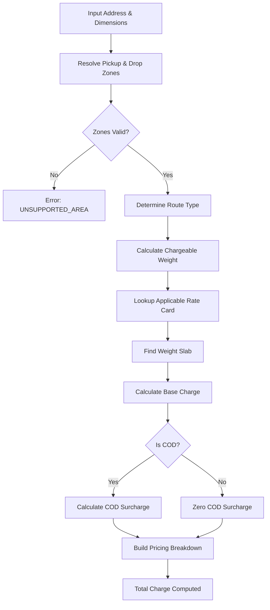

# Rate Calculation Engine - LastMileX

## Overview
The rate engine is an independently testable domain service that computes delivery charges based on configurable zone, rate card, and COD surcharge rules. It is the most critical business logic module.

## Architecture
The rate engine is a pure service module located in [`src/services/rate-engine/`](file:///c:/Notes/LastMileX/src/services/rate-engine/) with no dependencies on the HTTP framework or UI. It takes structured inputs and returns a deterministic pricing result.

```text
RateEngineService
├── calculateQuote(input: QuoteInput): QuoteResult
├── resolveZone(pinCode: string): Zone | null
├── calculateVolumetricWeight(l, b, h): number
├── calculateChargeableWeight(actual, volumetric): number
├── findApplicableRateCard(params): RateCard
├── findWeightSlab(rateCard, weight): WeightSlab
├── calculateBaseCharge(slab, weight): number
├── calculateCodSurcharge(baseCharge, routeType): number
└── buildPricingBreakdown(...): PricingBreakdown
```

### High-Level Flow


## Zone Detection

### Input Address Flow
1. Customer enters pickup address + PIN code and drop address + PIN code.
2. PIN code is extracted from each address.
3. PIN code is looked up in the `ServiceArea` table (`WHERE pinCode = ? AND isActive = true`).
4. `ServiceArea.zoneId` resolves to the `Zone`.
5. If PIN code is not found → error: `UNSUPPORTED_AREA`.

### Geocoding Requirements
- **MVP**: No geocoding API required. Pure PIN code → Zone mapping.
- **Future**: Optional Google Maps/Mapbox geocoding to extract PIN from free-text address.

### Zone Resolution Logic
```pseudocode
resolveZone(pinCode: string):
  1. Query: SELECT sa.*, z.* FROM ServiceArea sa JOIN Zone z ON sa.zoneId = z.id WHERE sa.pinCode = pinCode AND sa.isActive = true AND z.isActive = true
  2. If found → return { zone, serviceArea }
  3. If not found → return null (unsupported area)
```

### Route Type Determination
```pseudocode
determineRouteType(pickupZone, dropZone):
  if pickupZone.id === dropZone.id → INTRA_ZONE
  else → INTER_ZONE
```

### Unsupported Zone Handling
- If either pickup or drop PIN is not mapped to an active service area → reject with clear error.
- Quote endpoint returns specific error: `UNSUPPORTED_PICKUP_AREA` or `UNSUPPORTED_DROP_AREA`.
- Order creation is blocked until valid zones are resolved.

## Volumetric Weight Calculation
```text
volumetricWeight = (length_cm × breadth_cm × height_cm) / 5000
```
- Length, breadth, height in centimeters.
- Result in kilograms.
- Round to 2 decimal places.

### Edge Cases
- All dimensions must be `> 0`.
- Maximum dimension limits: configurable (default 300cm per side).
- Minimum: 1cm per side.

## Chargeable Weight
```text
chargeableWeight = MAX(actualWeight, volumetricWeight)
```
- Round **UP** to nearest 0.5 kg (ceiling in 0.5 increments).
  - *Example:* 2.1 kg → 2.5 kg, 3.0 kg → 3.0 kg, 3.6 kg → 4.0 kg.
- This rounding is standard in logistics.

## Rate Card Lookup

### Selection Algorithm
```pseudocode
findApplicableRateCard(customerType, routeType, pickupZoneId, dropZoneId, date = now()):
  1. For INTRA_ZONE:
     Query rate cards WHERE customerType = ? AND routeType = 'INTRA_ZONE'
       AND (sourceZoneId = pickupZoneId OR sourceZoneId IS NULL)
       AND isActive = true
       AND effectiveFrom <= date
       AND (effectiveTo IS NULL OR effectiveTo > date)
     ORDER BY sourceZoneId DESC NULLS LAST, effectiveFrom DESC
     LIMIT 1
     // Zone-specific intra-zone card takes priority over global

  2. For INTER_ZONE:
     Query rate cards WHERE customerType = ? AND routeType = 'INTER_ZONE'
       AND sourceZoneId = pickupZoneId AND destinationZoneId = dropZoneId
       AND isActive = true AND effectiveFrom <= date
       AND (effectiveTo IS NULL OR effectiveTo > date)
     ORDER BY effectiveFrom DESC
     LIMIT 1
     // If no specific zone-pair card found:
     Fallback: query with sourceZoneId IS NULL AND destinationZoneId IS NULL (global inter-zone)

  3. If no rate card found → error: NO_RATE_CARD_FOUND
```

### Weight Slab Definitions & Semantics

Each `WeightSlab` defines a pricing bracket with four fields:
- `minWeight` (kg): Lower weight threshold for this slab.
- `maxWeight` (kg): Upper weight threshold for this slab (inclusive).
- `basePrice` (INR): Base delivery fee for the slab.
- `perKgRate` (INR/kg): Incremental rate per additional kilogram exceeding `minWeight`.

#### Slab Formula
For a package with chargeable weight $w$ falling into slab $(minWeight, maxWeight]$:
$$\text{baseCharge} = \begin{cases} 
\text{basePrice} & \text{if } w \le \text{minWeight} \\
\text{basePrice} + (w - \text{minWeight}) \times \text{perKgRate} & \text{if } w > \text{minWeight}
\end{cases}$$

#### Boundary Examples

**Example Configuration:**
- Slab 1: `minWeight: 0.0`, `maxWeight: 1.0`, `basePrice: 50.00`, `perKgRate: 0.00` (Flat ₹50 up to 1kg)
- Slab 2: `minWeight: 1.0`, `maxWeight: 5.0`, `basePrice: 50.00`, `perKgRate: 15.00` (₹50 base + ₹15/kg above 1kg)
- Slab 3: `minWeight: 5.0`, `maxWeight: 20.0`, `basePrice: 110.00`, `perKgRate: 12.00` (₹110 base + ₹12/kg above 5kg)

**Calculations at Boundaries:**
1. **Weight = 0.5 kg**:
   - Matches Slab 1 ($0.0 \le w \le 1.0$).
   - $\text{baseCharge} = 50 + (0.5 - 0.0) \times 0 = \mathbf{50.00}$.
2. **Weight = 1.0 kg (Exact boundary of Slab 1)**:
   - Matches Slab 1 ($0.0 \le w \le 1.0$).
   - $\text{baseCharge} = 50 + (1.0 - 0.0) \times 0 = \mathbf{50.00}$.
3. **Weight = 1.5 kg (Enters Slab 2)**:
   - Matches Slab 2 ($1.0 < w \le 5.0$).
   - Excess weight $= 1.5 - 1.0 = 0.5\text{ kg}$.
   - $\text{baseCharge} = 50 + (0.5 \times 15) = \mathbf{57.50}$.
4. **Weight = 5.0 kg (Upper boundary of Slab 2)**:
   - Matches Slab 2 ($1.0 < w \le 5.0$).
   - Excess weight $= 5.0 - 1.0 = 4.0\text{ kg}$.
   - $\text{baseCharge} = 50 + (4.0 \times 15) = \mathbf{110.00}$.
5. **Weight = 5.5 kg (Enters Slab 3)**:
   - Matches Slab 3 ($5.0 < w \le 20.0$).
   - Excess weight $= 5.5 - 5.0 = 0.5\text{ kg}$.
   - $\text{baseCharge} = 110 + (0.5 \times 12) = \mathbf{116.00}$.

### Weight Slab Selection
```pseudocode
findWeightSlab(rateCardId, chargeableWeight):
  Query weight slabs WHERE rateCardId = ? 
    AND (
      (minWeight = 0 AND minWeight <= chargeableWeight AND maxWeight >= chargeableWeight)
      OR (minWeight < chargeableWeight AND maxWeight >= chargeableWeight)
    )
  ORDER BY minWeight ASC
  LIMIT 1

  If no slab matches → error: WEIGHT_OUT_OF_RANGE
```

### Base Charge Calculation
```pseudocode
calculateBaseCharge(slab, chargeableWeight):
  if chargeableWeight <= slab.minWeight:
    return slab.basePrice
  else:
    additionalWeight = chargeableWeight - slab.minWeight
    return slab.basePrice + (additionalWeight * slab.perKgRate)
```

## COD Surcharge
```pseudocode
calculateCodSurcharge(baseCharge, routeType, paymentType, date = now()):
  if paymentType !== 'COD': return 0

  Find active CodSurcharge rule WHERE routeType = ? AND isActive = true
    AND effectiveFrom <= date AND (effectiveTo IS NULL OR effectiveTo > date)
  ORDER BY effectiveFrom DESC
  LIMIT 1

  if surchargeType === 'FLAT':
    return surchargeValue
  elif surchargeType === 'PERCENTAGE':
    calculated = baseCharge * (surchargeValue / 100)
    if minSurcharge && calculated < minSurcharge: return minSurcharge
    if maxSurcharge && calculated > maxSurcharge: return maxSurcharge
    return calculated

  if no rule found: return 0 (or configurable default)
```

## Complete Pricing Breakdown

The quote response returns the following structure:
```typescript
interface PricingBreakdown {
  pickupZone: { id: string; name: string; code: string };
  dropZone: { id: string; name: string; code: string };
  routeType: 'INTRA_ZONE' | 'INTER_ZONE';
  customerType: 'B2B' | 'B2C';
  paymentType: 'PREPAID' | 'COD';
  actualWeight: number;
  volumetricWeight: number;
  chargeableWeight: number;
  rateCard: { id: string; name: string };
  weightSlab: { minWeight: number; maxWeight: number; basePrice: number; perKgRate: number };
  baseCharge: number;
  codSurcharge: number;
  totalCharge: number;
}
```

## Pricing Snapshot Strategy

### At Order Creation
1. Calculate quote using current rate cards.
2. Store complete pricing breakdown in `OrderPricingSnapshot`.
3. Snapshot includes rate card ID, weight slab data, all computed values.
4. Snapshot also stores `snapshotData` JSON with full rate card context.

### Historical Accuracy
- Once stored, the pricing snapshot is **IMMUTABLE**.
- Even if rate cards change, the order retains original pricing.
- The snapshot contains enough data to reconstruct the calculation independently.
- For audit: `snapshotData` JSON preserves the exact rate card and slab used.

### Rate Card Versioning
- Rate cards have `effectiveFrom` and `effectiveTo` dates.
- Changing rates = create new rate card with new `effectiveFrom`, deactivate old.
- Old rate cards are NEVER deleted or modified.
- Existing orders reference their snapshot, not the current rate card.

## Edge Cases & Error Handling

| Scenario | Handling |
|---|---|
| Pickup PIN not in service area | Return `UNSUPPORTED_PICKUP_AREA` error |
| Drop PIN not in service area | Return `UNSUPPORTED_DROP_AREA` error |
| No rate card for zone pair/type | Return `NO_RATE_CARD_FOUND` error |
| Weight exceeds all slabs | Return `WEIGHT_OUT_OF_RANGE` error |
| Zero or negative dimensions | Validation error before calculation |
| Zero weight | Validation error |
| Multiple active rate cards match | Most specific wins (zone-specific > global), then most recent `effectiveFrom` |
| COD but no surcharge rule | Apply zero surcharge (log warning) |
| Rate card deactivated between quote and order | Re-calculate at order creation; if no card, reject |

## Testing Strategy
- Unit test every individual function.
- Test volumetric weight with known values.
- Test chargeable weight rounding.
- Test rate card selection priority (specific vs global).
- Test weight slab boundaries (exact match, just over, just under).
- Test COD surcharge types (flat, percentage, min/max caps).
- Test zone resolution (found, not found, inactive).
- Test complete end-to-end quote with fixtures.
- Test that pricing snapshot preserves correct values.
- Test rate card versioning (old vs new effective dates).
- Edge case: weight exactly at slab boundary.
- Edge case: intra-zone with zone-specific and global rate cards.
